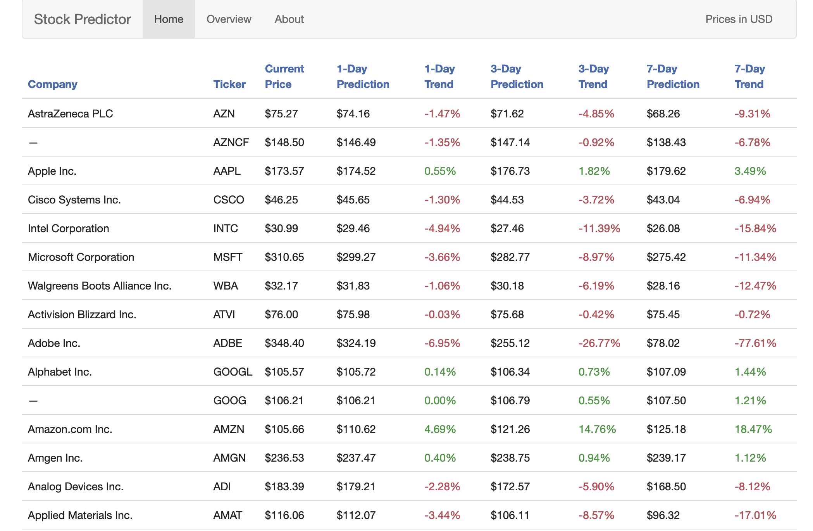
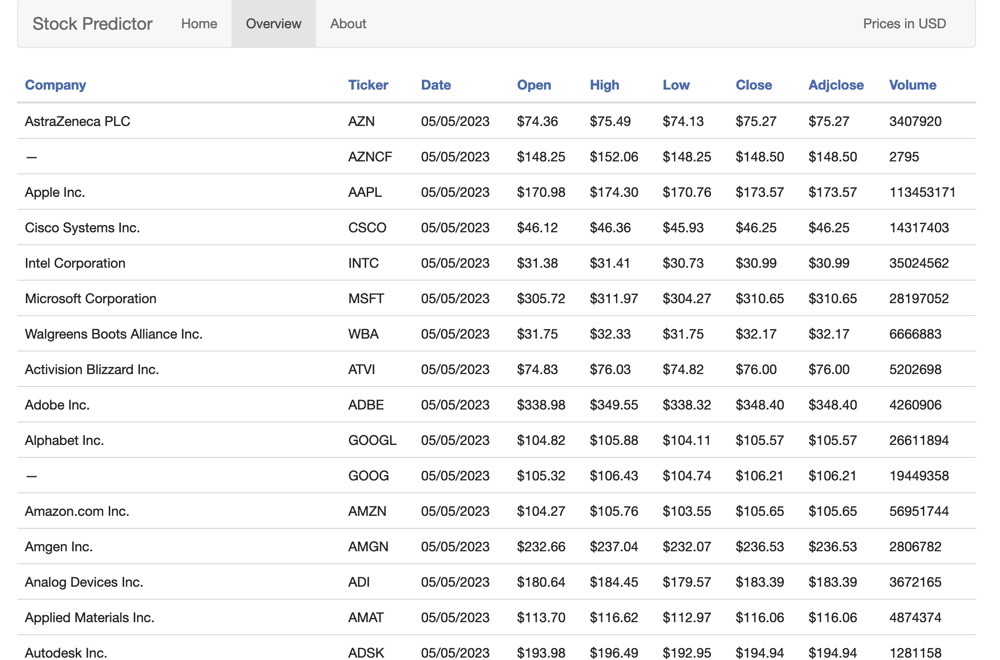

# 568_project
Stock Predictor based on Yahoo finance and LSTM model





# Installation before run
1. Initial model can be trained on JupyterNotebook or Google Colab, so either one of these will be needed to run the program from scratch.
2. Web application is based on Django, so Django must be installed.
3. To train the model, Tensorflow is needed.
4. yahoo_fin, pytickersymbols, django_tables2 libraries are needed

# Run on local devices (default port: 8000)
```
cd 568_project/backend/server
```
```
python manage.py runserver
```
Model last trained on 5/5/2023 with read-time stock data. It will take some time for the model to be trained again for current data.
